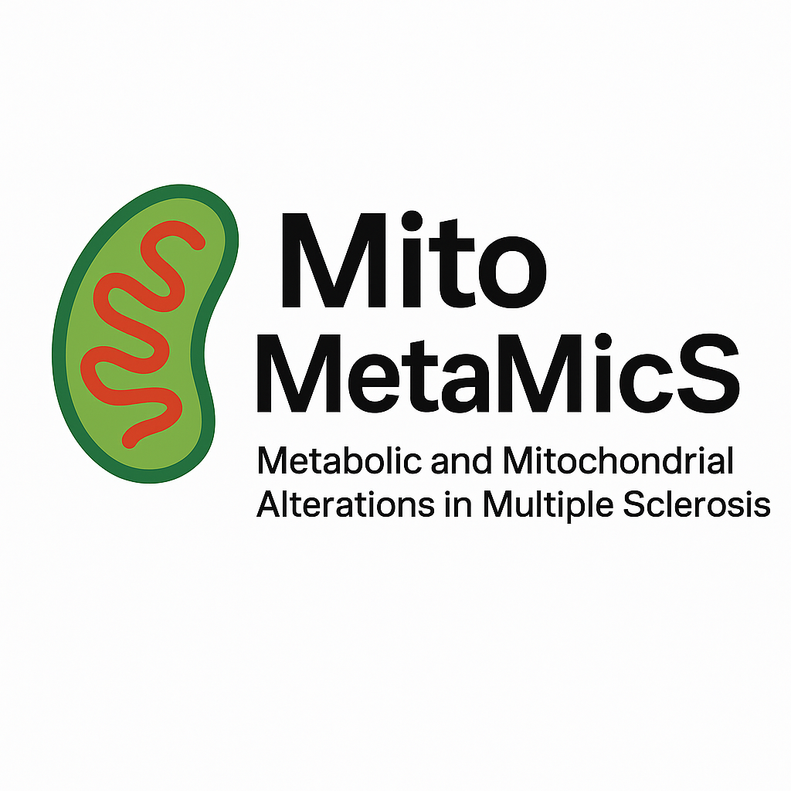

# metaoMicS

**Metabolic and mitochondrial alterations in Multiple Sclerosis (MS)**
<p align="center">
  
</p>
`metaoMicS` is a research repository focused on the analysis of metabolic and mitochondrial pathways in neuroinflammation and MS. It brings together spatial transcriptomics, omics integration, and computational biology to explore how energetic dysfunction shapes lesion microenvironments.

---

## Features
- 🧬 **Spatial omics analysis** (Xenium, spatial sc-proteomics, etc.)
- 🔋 **Metabolic pathway mapping** (glycolysis, , lactate metabolism)
- ⚡ **Mitochondrial stress & dysfunction** profiling
- 🧩 **Data integration** across transcriptomic, proteomic, and metabolomic layers

---

## Repository structure
- `notebooks/` → Jupyter notebooks for analyses  
- `data/` → Example or reference data (if shareable)  
- `figures/` → Output plots, heatmaps, spatial maps  

---

## Getting started
Clone the repo:
```bash
git clone https://github.com/chritoffermattssonlangseth/metaoMicS.git
cd metaoMicS